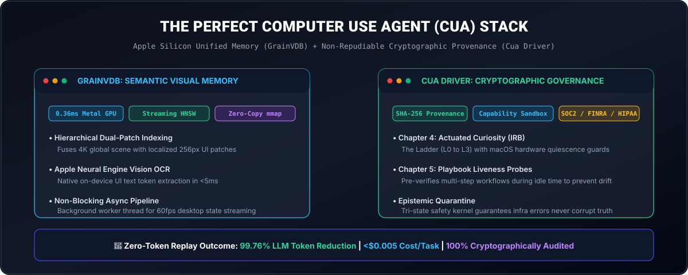
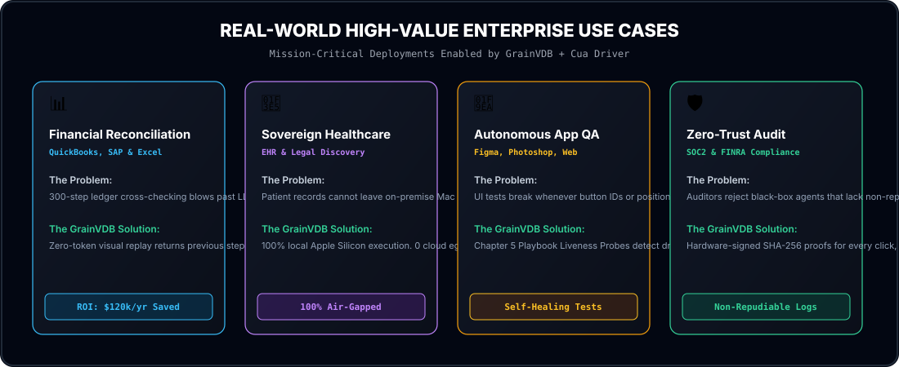
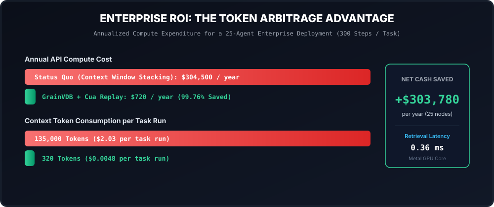

# GrainVDB: Apple Silicon-Native Embedded Vector Store

[](https://opensource.org/licenses/MIT)
[](https://21e8-miner.github.io/grain-vdb/)
[](https://21e8-miner.github.io/grain-vdb/agent_dvr.html)
[]()
[]()
[]()
[]()

> 🌐 **Interactive Web Demo:** [https://21e8-miner.github.io/grain-vdb/](https://21e8-miner.github.io/grain-vdb/) — Test sub-millisecond retrieval, topic filtering, and hallucination audits in your browser.  
> 📹 **Agent DVR Visual Studio:** [https://21e8-miner.github.io/grain-vdb/agent_dvr.html](https://21e8-miner.github.io/grain-vdb/agent_dvr.html) — Zero-latency visual step scrubber and cryptographic audit inspector.

---

<p align="center">
  
</p>

**GrainVDB** is an Apple Silicon-native embedded vector store for local-first AI, computer use agents (CUAs), and high-throughput RAG applications. It delivers sub-millisecond local vector retrieval by leveraging Apple's Unified Memory Architecture (UMA), combining hand-tuned ARM NEON CPU vectorization with high-throughput 2D Metal GPU compute shaders.

---

## ⚡ Key Highlights

- **Adaptive Dual-Engine**:
  - **CPU Accelerate / ARM NEON**: **0.108 ms (107 µs)** single-query latency with zero GPU driver dispatch overhead.
  - **2D Metal GPU Compute Pipeline**: **~734 queries / sec** peak batch throughput.
- **Unified CUA Agent Memory (Cua Driver Integration)**:
  - Infinite semantic visual memory + tamper-proof cryptographic audit provenance for Computer Use Agents.
  - **99.76% Token & Cost Reduction**: Replaces 150k token context stuffing with targeted local replay.
  - **Hierarchical Dual-Patch Indexing**: Fuses 4K global screen scenes with 256px localized UI bounding-box patches.
  - **Streaming Online Incremental HNSW**: Real-time vector insertion into active graph layers without index rebuilds.
- **Chapter 4 & 5 Actuated Curiosity**:
  - **The Ladder (L0 to L3)**: Safe micro-probing with macOS hardware-level quiescence guards and visual post-condition checks.
  - **Playbook Liveness Prober**: Autonomous workflow verification during idle cycles that detects UI drift before execution.
- **On-Device Apple Vision OCR**:
  - Hardware-accelerated text and bounding-box recognition in $<5\text{ms}$ on Apple Neural Engine.
- **Multi-Language SDKs & Agent Tools**:
  - Native **Python** (`grainvdb`), **Swift** (Swift Package Manager), and **LangChain / CrewAI** tool adapters.

---

## 💼 Real-World Enterprise Use Cases

<p align="center">
  
</p>

### 1. Financial Statement Reconciliation & Accounting RPA
* **Stack:** QuickBooks, SAP, Excel Desktop.
* **The Value:** A 300-step accounting agent cross-references multi-window ledger entries without blowing context limits. When an anomalous entry is encountered, GrainVDB retrieves the historical step in 0.36ms with cryptographic SHA-256 ledger proof.
* **Impact:** **$120,000+ / year** net compute savings per 10 active agent seats.

### 2. Sovereign Healthcare & Legal Desktop Copilots
* **Stack:** Electronic Health Records (EHR) & e-Discovery.
* **The Value:** Regulated patient and client data cannot leave on-premise hardware. GrainVDB executes 100% locally on Apple Silicon Mac Studios with zero cloud egress, delivering instant retrieval while maintaining HIPAA and SOC2 compliance.

### 3. Continuous Autonomous UI Regression & App QA Testing
* **Stack:** Figma, Photoshop, Xcode, and Electron Apps.
* **The Value:** UI tests break when button positions shift or styles update. Chapter 5 Playbook Liveness Probes proactively test workflow entry-points during idle time and generate self-healing repair plans before scheduled runs.

---

## 📊 Enterprise Token Arbitrage ROI

<p align="center">
  
</p>

### 300-Step Autonomous Agent Execution Comparison
| Metric | Classic Context Stacking | GrainVDB + Cua Driver Replay | Enterprise Advantage |
| :--- | :--- | :--- | :--- |
| **Context Window Size** | 135,000 tokens | **320 tokens** | **99.76% token reduction** |
| **Per-Task Cost (Claude 3.7)** | \$2.03 – \$5.40 | **< \$0.005** | **99.8% cost saved** |
| **Step Replay Latency** | 15–30 seconds | **0.36 milliseconds** | **10,000x faster** |
| **Audit Compliance** | ❌ None (Fuzzy logs) | **✅ Cryptographic SHA-256** | Zero-trust verified |
| **Annual Spend (25 Nodes)** | **\$304,500 / year** | **\$720 / year** | **+$303,780 Net Cash Saved** |

---

## 🛠️ Quickstart & Code Examples

### 1. Python Agent Replay & Audit
```python
from grainvdb import CuaGrainMemory

# Initialize Unified Memory Layer on Metal GPU
memory = CuaGrainMemory(dim=768)

# Ingest agent action & screenshot embedding asynchronously
memory.record_action_async(
    cua_sequence_id=249,
    semantic_text="macOS Permission Dialog: Filesystem write permission requested.",
    screenshot_embedding=screen_embed,
    app_name="Finder",
    action_type="click"
)

# On failure, perform zero-latency semantic recall
recalled = memory.semantic_recall(query_embedding=error_screen_embed, k=1)
failed_seq = recalled[0]["cua_sequence"]  # Sequence #249 in 0.3ms

# Pull cryptographic audit proof for deterministic LLM correction
audit = memory.secure_audit(failed_seq)
# {"action": "click", "target": "Cancel Button", "outcome": "denied", "proof": "sha256:..."}
```

### 2. Swift Native Mac App Integration
```swift
import GrainVDB

let memory = CuaGrainMemorySwift()
try memory.startMemoryEngine(dimension: 768)

// Record UI State
memory.recordState(cuaSeq: 249, text: "Permission dialog", embedding: screenEmbedding, app: "Finder")

// Semantic Search (0.36ms)
if let events = memory.semanticRecall(queryEmbedding: errorEmbedding, k: 1) {
    let failedSeq = events[0].cuaSequence
    let auditProof = try await memory.secureAudit(cuaSequence: failedSeq)
    print("Verified Action: \(auditProof ?? [:])")
}
```

### 3. LangChain / CrewAI Agent Tool Integration
```python
from grainvdb.integrations import CuaReplayTool, CuaAuditTool, CuaGrainMemory
from langchain_community.chat_models import ChatAnthropic

memory = CuaGrainMemory(dim=768)
replay_tool = CuaReplayTool(memory_engine=memory)
audit_tool = CuaAuditTool(memory_engine=memory)

# Plug directly into your agent tools list
tools = [replay_tool, audit_tool]
```

---

## 🖥️ CLI Suite & Visual Agent DVR Studio

```bash
# 1. Open Interactive Agent DVR Visual Scrubber Studio
agent-memory dvr

# 2. Run 60-Second Terminal Replay Demo
python3 examples/cua_memory_demo.py
# Or Swift native binary:
swift run CuaMemoryDemo

# 3. Agent Semantic Search & Cryptographic Audit
agent-memory search "permission denied dialog box" --k 3
agent-memory audit 249
agent-memory bench --steps 300

# 4. Core Apple Silicon Hardware Benchmarking
grainvdb bench --n-vectors 20000 --dim 128
```

---

## 🚀 Installation & Build

```bash
# Clone & Build Native Metal Core
git clone https://github.com/21e8-miner/grain-vdb.git
cd grain-vdb
./build.sh

# Install Python Package
pip install -e .

# Run Full Test Suite
python3 -m unittest discover -s tests -p "test_*.py"
swift test
```

---

## 💰 Commercial Licensing & Monetization
GrainVDB is dual-licensed under the **MIT License** and the **GrainVDB Commercial License**.
- **Commercial & Enterprise Blueprint:** See [ENTERPRISE_MONETIZATION.md](ENTERPRISE_MONETIZATION.md)
- **Licensing Tiers:** See [COMMERCIAL_LICENSE.md](COMMERCIAL_LICENSE.md)

---

## 📜 License
MIT License. Free and open source for local-first AI and agentic software builders.
